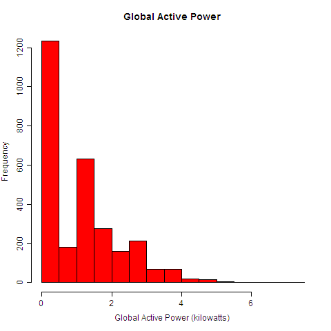
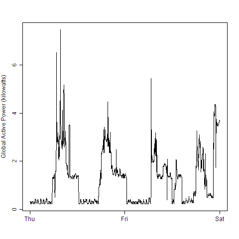
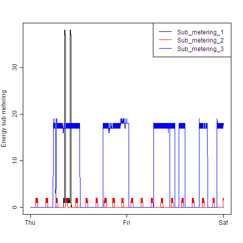
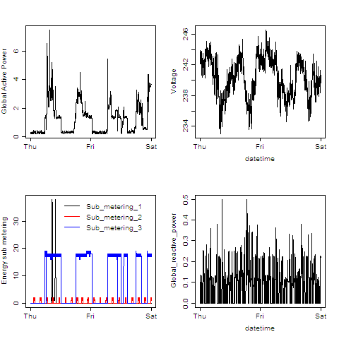

## Exploration of Power Consumption Data
### Grace Pehl, PhD

Data from the [UC Irvine Machine Learning Repository](http://archive.ics.uci.edu/ml/).  An examination of how household energy usage varied over a 2-day period in February, 2007, using the base plotting system in R and analysis packages dplyr and data.table.

